# ukiyo

A CLI that turns a manifest of sprites into reviewed, packed texture atlases.
It writes image prompts from your style file, generates the images, cuts them
into sprites, and packs the approved ones for Phaser, React or any engine that
reads a JSON hash.

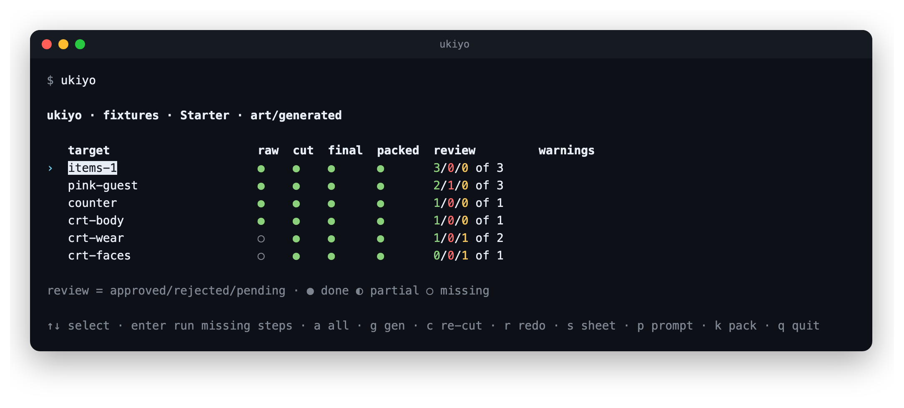

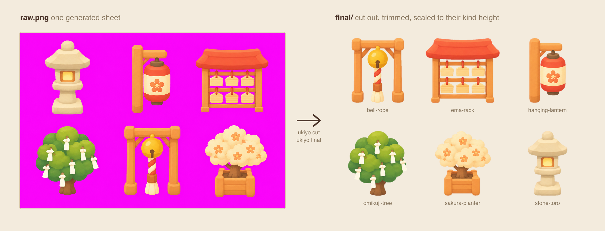

## Examples

Six projects in [`examples/`](examples), one style each. All are lineless.

| Example | Style |
|---|---|
| [`lucky-cat-shrine`](examples/lucky-cat-shrine) | Kawaii oblique, soft cel shading |
| [`ramen-inc`](examples/ramen-inc) | Same style, different game |
| [`zen-garden`](examples/zen-garden) | Soft watercolour |
| [`starfall`](examples/starfall) | Vinyl toy spaceships |
| [`neon-alley`](examples/neon-alley) | Cosy cyberpunk |
| [`runeforge`](examples/runeforge) | Hand-painted RPG weapons and runes |

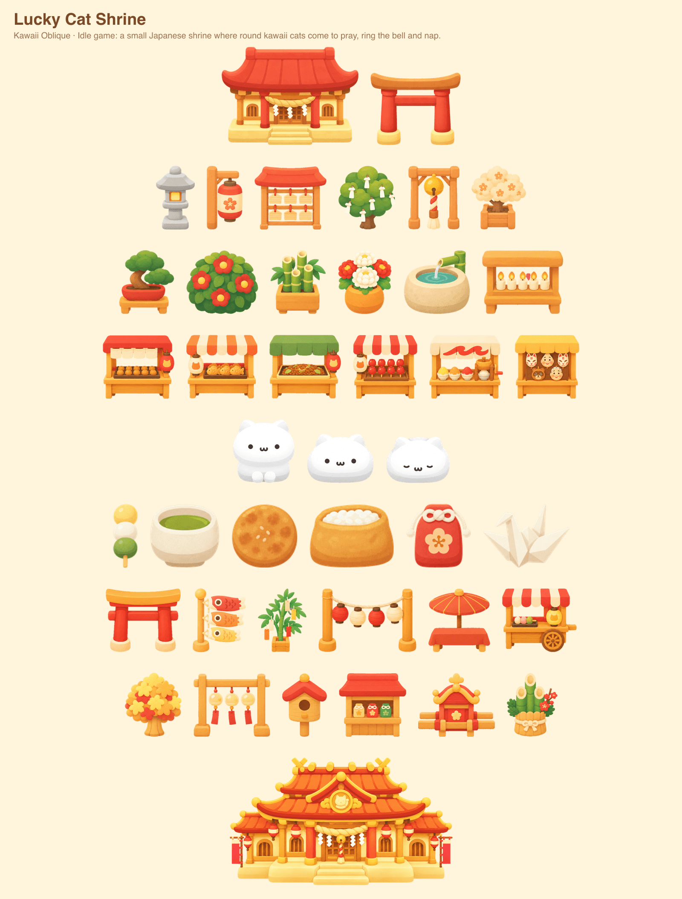

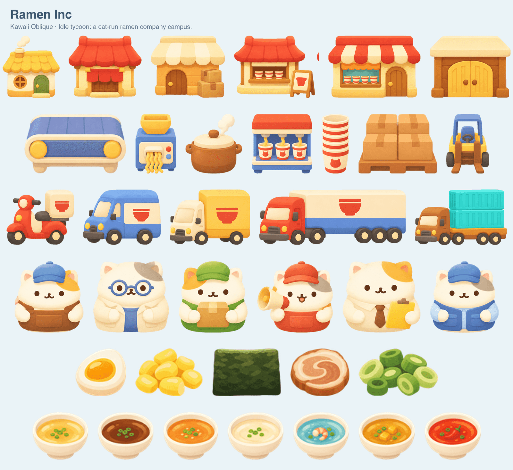

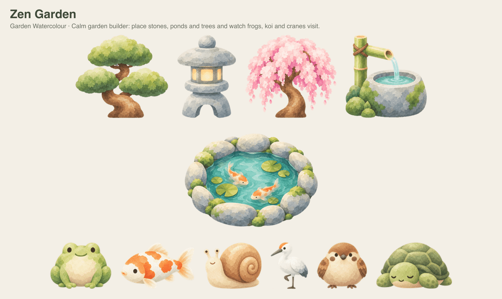

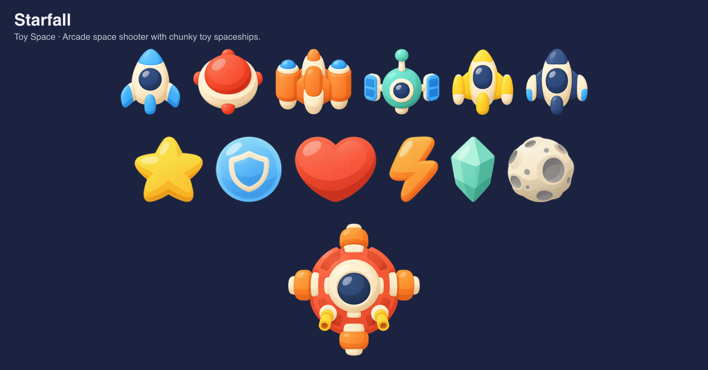

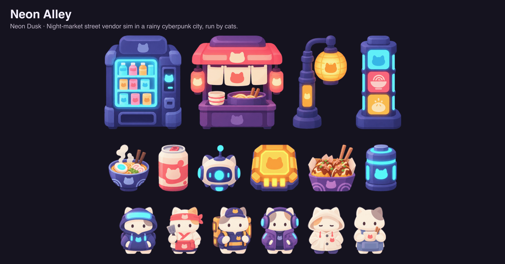

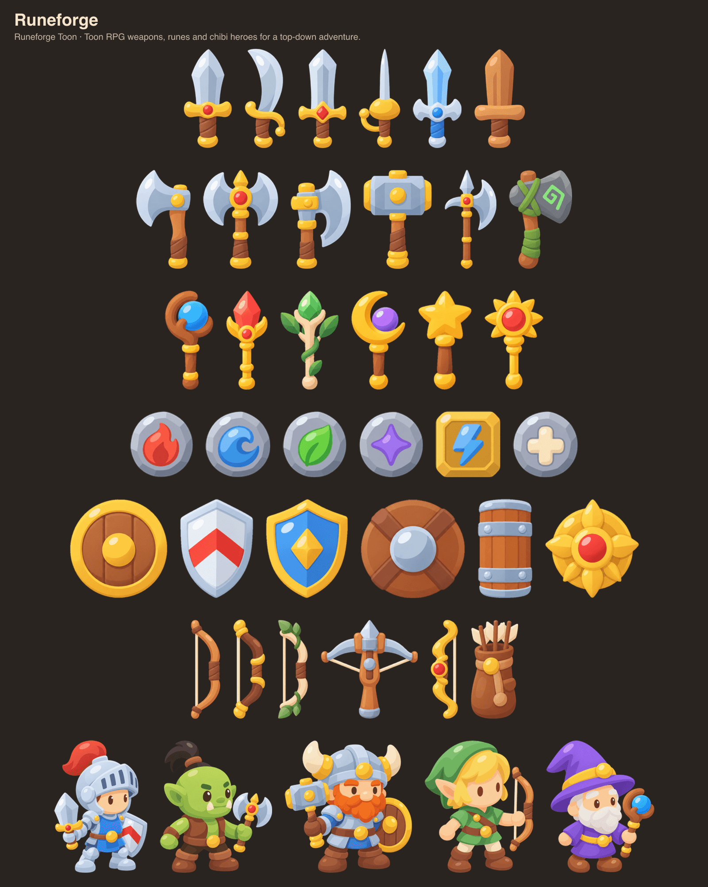

## Requirements

- Node 22.12 or newer.
- One image provider:
  - `codex` (default): [Codex CLI](https://github.com/openai/codex), logged in, with `image_generation` on.
  - `openai`: set `OPENAI_API_KEY`.
  - `manual`: copy the prompt with `ukiyo prompt <target> --copy`, then `ukiyo import` the image.

## Install

```bash
git clone https://github.com/wynlo/ukiyo.git
cd ukiyo
npm install
npm link
ukiyo skill install   # optional: Claude Code skill
```

## Usage

```bash
ukiyo init --name "My Game"   # ukiyo.json, art/style.md, art/manifest.json
ukiyo doctor
ukiyo all                     # gen, cut, final, sheet; stops at review
ukiyo review                  # approve, reject or redo in the browser
ukiyo pack                    # approved assets only
```

Run `ukiyo` with no arguments for the dashboard.

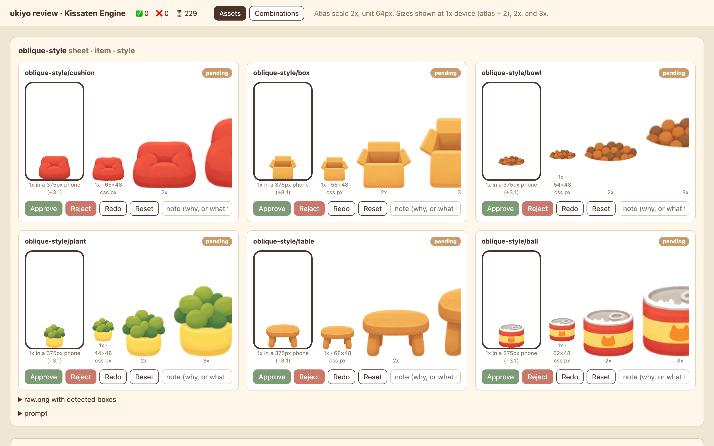

| Command | Description |
|---|---|
| `init` | Write `ukiyo.json`, a starter style file and manifest. |
| `style` | Validate the style file. |
| `prompt <target>` | Print the prompt and its reference images. |
| `prompts [eject]` | List or copy the prompt templates. |
| `gen [targets]` | Generate raw images. |
| `import <file> --target <t>` | Bring in an image made elsewhere. |
| `animate [targets]` | Redraw strip frames as edits of the first frame. |
| `edit <target> <asset> "<text>"` | Change one asset. |
| `cut [targets]` | Cut out sprites and remove the background. |
| `final [targets]` | Trim, align and resize. |
| `sheet [targets]` | Contact sheet and frame player. |
| `plan [targets]` | Plan multipart props. |
| `review` | Serve the review page. |
| `status` | Status table. Exits 1 while anything is pending. |
| `pack [groups]` | Write atlases. |
| `all [targets]` | Every step up to review. |
| `redo <target> [asset]` | Delete outputs so they regenerate. |
| `doctor` | Check the setup. |

## Style file

`art/style.md` is the project's art direction: YAML front matter (palette,
linework, shading, banned traits, background colour) and a Markdown body that
goes into every prompt. See [`style.md`](skills/ukiyo/reference/style.md).

## Configuration

`ukiyo.json` in the project root. Only `project.name` is required.

```json
{
  "project": { "name": "My Game" },
  "provider": { "name": "codex" },
  "atlas": { "dir": "public/assets/atlas", "scale": 2, "unit": 64 },
  "kinds": {
    "furniture": { "height": 2, "anchor": "bottom-center", "aspect": "2:1" },
    "item": { "height": 0.75, "anchor": "center", "aspect": "1:1" }
  },
  "references": { "anchors": ["docs/references/style-anchor.png"] }
}
```

Every field is in the [manifest reference](skills/ukiyo/reference/manifest.md).

## Features

- **References.** Each generation sends reference images (anchors and
  approved finals) so new art matches old art.
- **Layered characters.** `layer` targets are edits of a shared base. They
  are packed as overlays and can be tint-ready.
- **Multipart props.** `split` targets cut an approved sprite into pieces
  with joints, so lanterns and paper strips can move. `ukiyo plan` picks the
  pieces. Below: props from the examples at rest, in a gust of wind, then
  each one used. Motion is scaled up 5x.
- **Lights.** `final` finds lit regions in the art and `pack` writes them
  into the atlas.

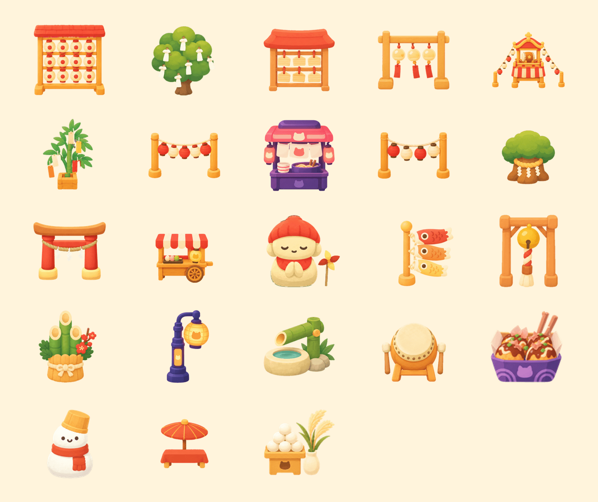

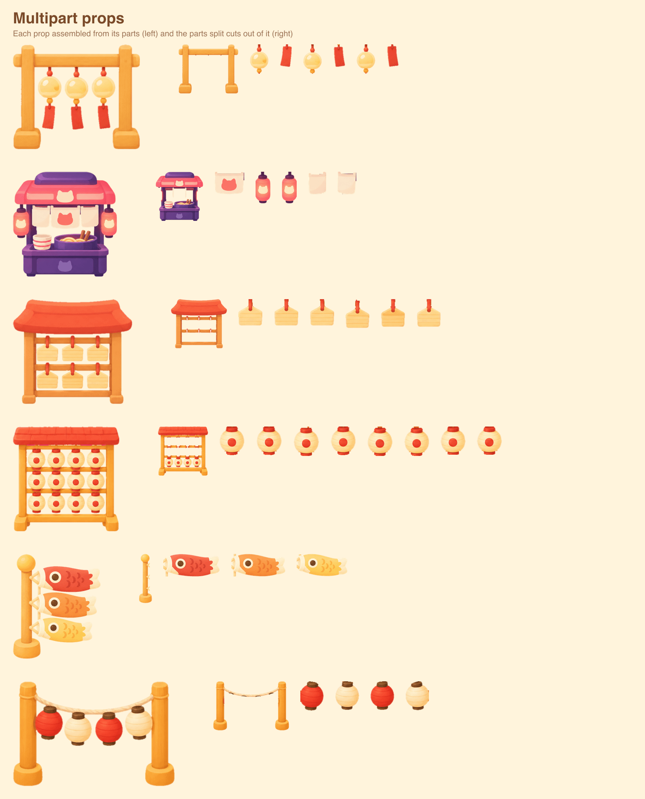

Engine notes: [`phaser.md`](skills/ukiyo/reference/phaser.md),
[`react.md`](skills/ukiyo/reference/react.md).

## Development

```bash
npm run typecheck
npm run build
npm run fixtures   # fake project in fixtures/out
npm run showcase   # renders docs/examples/
```

## Troubleshooting

See [`troubleshooting.md`](skills/ukiyo/reference/troubleshooting.md).

## License

[MIT](LICENSE)
