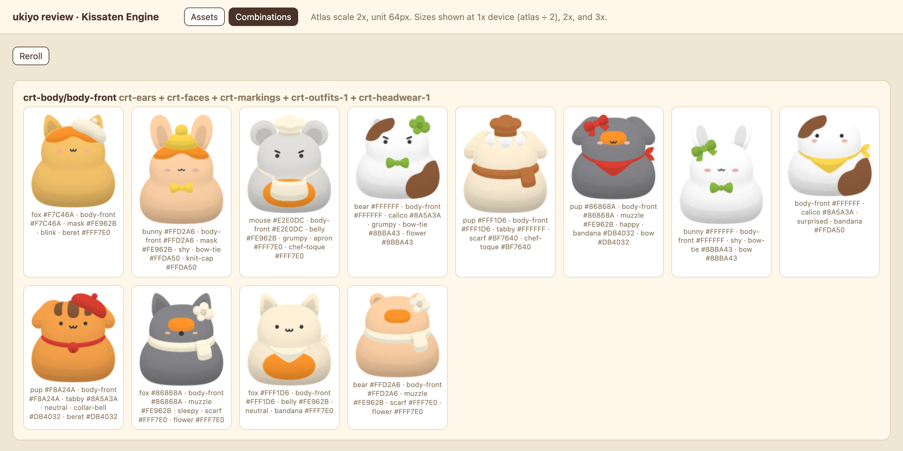
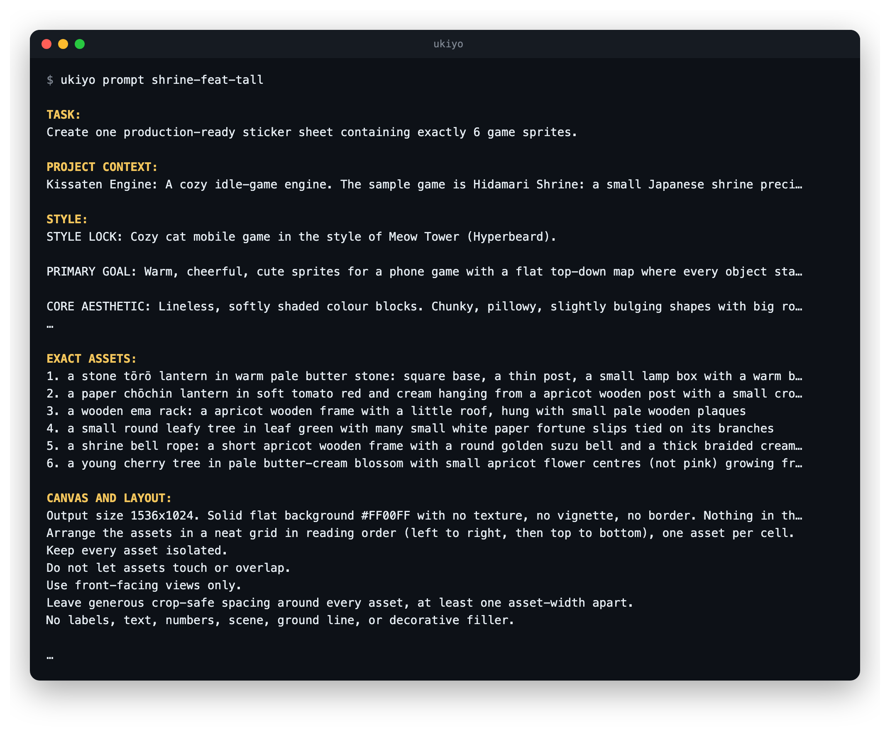
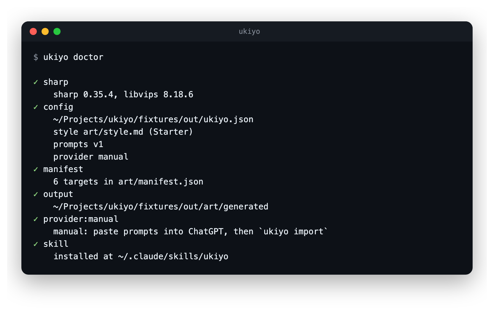

# ukiyo

A CLI that turns a manifest of named sprites into reviewed, packed texture
atlases. It composes image prompts from your project's style file, generates
images, cuts sheets into sprites, removes backgrounds, aligns animation frames,
puts every sprite through a review page, and packs atlases for Phaser, React or
any engine that reads a JSON hash.


## Requirements

- Node 22.12 or newer.
- One image provider:
  - `codex` (default): [Codex CLI](https://github.com/openai/codex) logged in
    with the `image_generation` feature on. Uses your ChatGPT plan, no API key.
  - `openai`: set `OPENAI_API_KEY`.
  - `manual`: run `ukiyo prompt <target> --copy`, generate the image in any
    tool, then bring it in with `ukiyo import`.

## Install

```bash
git clone https://github.com/wynlo/ukiyo.git
cd ukiyo
npm install
npm link            # puts `ukiyo` on PATH
```

Optional, for [Claude Code](https://claude.com/claude-code) users:

```bash
ukiyo skill install            # links the skill into ~/.claude/skills/ukiyo
ukiyo skill install --project  # or into ./.claude/skills/ukiyo
```

## Usage

In your game project:

```bash
ukiyo init --name "My Game"   # writes ukiyo.json, art/style.md, art/manifest.json
# describe your art in art/style.md
# list your sprites in art/manifest.json
ukiyo doctor
ukiyo all          # gen, cut, final, sheet; stops at the review gate
ukiyo review       # approve / reject / redo each asset in the browser
ukiyo pack         # approved assets only
```

Run `ukiyo` with no arguments for the dashboard.

### Review

`ukiyo review` opens a local page with every asset at 1x, 2x and 3x, and
inside a phone frame. Approve, reject or redo each one. `pack` only takes
approved assets.


The Combinations tab draws each base with random layers and tints. Use it to
check that layered characters fit together.



### Prompts and checks

`ukiyo prompt <target>` prints the composed prompt. `ukiyo doctor` checks the
setup.

<p>
  
  
</p>

| Command | Description |
|---|---|
| `init [--name] [--force]` | Write `ukiyo.json`, a starter `art/style.md` and an example manifest. |
| `style` | Validate the style file and print it as JSON. |
| `prompt <target> [--copy]` | Print the composed prompt. |
| `prompts` | List prompt template versions. |
| `prompts eject [dir]` | Copy the active templates into the project to edit them. |
| `gen [targets] [--force]` | Generate raw images. |
| `import <file> --target <t> [--asset <id>]` | Bring in an image generated elsewhere. Layer targets need `--asset`. |
| `animate [targets]` | Regenerate strip frames as edits of the first frame. |
| `edit <target> <asset> "<instruction>"` | Iterate one asset. |
| `cut [targets]` | Detect components, cut out, remove background. |
| `final [targets]` | Trim, align frames, resize to the kind height. |
| `sheet [targets] [--open]` | Contact sheet and frame player. |
| `review [--port]` | Serve the review page (the approval gate). |
| `status [--json]` | Status table. Exits 1 while anything is pending or rejected. |
| `pack [groups] [--allow-pending]` | Write atlases. |
| `all [targets]` | Every step up to the gate. Packs when everything is approved. |
| `redo <target> [asset]` | Delete outputs so the next run regenerates them. |
| `doctor` | Check sharp, config, style, manifest, provider and skill. |
| `skill install [--project]` | Link the Claude Code skill. |

## Style file

The art direction for a project is in its `art/style.md`. ukiyo does not
include any styles. The file has YAML front matter (palette, linework, shading, rendering rules,
banned traits, background colour) and a Markdown body. The body goes into every
prompt as the STYLE section.

```markdown
---
name: Soft Paper
canvas:
  backgroundColor: "#FFFFFF"
linework:
  outlineColor: none
palette:
  - { name: Apricot, hex: "#F7BB5C", usage: fill }
bannedTraits: [outlines, realism, text]
---

STYLE LOCK: Warm cheerful sprites for a phone game with a flat top-down map.
...
```

The full field list is in
[`skills/ukiyo/reference/style.md`](skills/ukiyo/reference/style.md).

## Prompt templates

Prompt wording is in static template files under [`prompts/`](prompts/), one
folder per version (`prompts/v1/`). A project pins a version with
`prompts.version`, and each target's `meta.json` records the version used.
Released versions do not change. New wording goes into a new version folder.

To customise the wording for one project, run `ukiyo prompts eject`. It
copies the templates to `art/prompts` and sets `prompts.dir`. Files there
override the built-in files of the same name. See
[`prompts/README.md`](prompts/README.md).

## Configuration

`ukiyo.json` in the project root. Every path is relative to it. Every field
except `project.name` is optional.

```json
{
  "project": { "name": "My Game", "description": "Cozy idle game in a seaside town" },
  "style": { "file": "art/style.md", "additionalDetails": "" },
  "prompts": { "version": "v1" },
  "manifest": "art/manifest.json",
  "out": "art/generated",
  "provider": { "name": "codex", "gapMs": 8000, "model": "gpt-image-2", "effort": "low" },
  "cutout": { "mode": "flood", "threshold": 102, "feather": 1.5, "despill": true, "mergeGap": 14, "minArea": 400 },
  "atlas": { "dir": "public/assets/atlas", "groupBy": "game", "scale": 2, "unit": 64, "format": "phaser-hash" },
  "kinds": {
    "backdrop":  { "width": 8, "anchor": "top-left" },
    "furniture": { "height": 2, "anchor": "bottom-center" },
    "visitor":   { "height": 1.5, "anchor": "bottom-center" },
    "item":      { "height": 0.75, "anchor": "center" },
    "icon":      { "height": 0.5, "anchor": "center" }
  }
}
```

`style.additionalDetails` is appended to every prompt as `ADDITIONAL DETAILS:`.

`tints` (optional) lists sample colours per tint channel. The review page uses
them to preview tint-ready assets and random layer combinations:

```json
"tints": { "fur": ["#E8A866", "#9C8F84"], "fabric": ["#A7BFA3", "#EFD88B"] }
```

The manifest schema is in
[`skills/ukiyo/reference/manifest.md`](skills/ukiyo/reference/manifest.md).
Engine notes are in [`phaser.md`](skills/ukiyo/reference/phaser.md) and
[`react.md`](skills/ukiyo/reference/react.md).

## Layered characters

To make many characters from a small set of assets, draw one shared base (a
body) and add items as `layer` targets. Each layer is an edit of the base. ukiyo registers
the edit to the base, keeps only the new pixels, and writes the overlay at the
base's scale with its pivot on the base's anchor point. An engine draws the
base and any overlays at the same position.

Set `tint` on the base and on layers to make them tint-ready: fills come out
neutral grey and the outline keeps its colour, so a multiply tint recolours
them. The atlas frame carries the tint channel.

## Project layout

```
src/cli.tsx          commander entry, Ink screens
src/config.ts        ukiyo.json schema
src/style.ts         style file parser and the init starter
src/manifest.ts      manifest schema
src/prompt/          template loader and prompt composer
prompts/v1/          prompt templates (Handlebars)
src/providers/       codex, openai, manual
src/ops/             autocrop, cutout, crop, raster, register, stroke, tint, pack, sheet
src/pipeline.ts      the steps
src/review/          review page server
src/ui/              Ink components
skills/ukiyo/        Claude Code skill
fixtures/            smoke test (npm run fixtures)
```

## Development

```bash
npm run typecheck
npm run build
npm run fixtures     # writes fixtures/out with fake generated images
cd fixtures/out
ukiyo cut && ukiyo final && ukiyo sheet && ukiyo review
```

## Troubleshooting

See [`skills/ukiyo/reference/troubleshooting.md`](skills/ukiyo/reference/troubleshooting.md).

## License

[MIT](LICENSE)
